# 1. Начало пути

На вводном уроке мы расскажем о материалах, необходимых для прохождения курса. Вы узнаете, что такое скетчинг, какие виды его есть и как его можно использовать в проектах и в жизни.

## Содержание

+ [1.1 Введение](#11-введение)
+ [1.2 Скетчинг - это...](#12-скетчинг)
+ [1.3 Типы и виды скетчинга](#13-типы-и-виды-скетчинга)
+ [1.4 Инструменты и материалы](#14-инструменты-и-материалы)
+ [1.5 Итоговый тест по пройдённому материалу](#15-итоговый-тест-по-пройдённому-материалу)

## 1.1 Введение

Добро пожаловать на первый урок курса **"Основы скетчинга для начинающих"**!

В этом курсе мы будем знакомиться с основами скетчинга и его значимостью в различных сферах жизни и работы. Узнаем, какие преимущества может принести владение этой универсальной техникой.

Мы рассмотрим различные профессии и области, где скетчинг может найти свое применение, будь то графика, живопись, дизайн, архитектура, инженерное дело и многие другие. Вы поймете, как скетчи могут стать мощным инструментом для визуализации идей, передачи информации и создания эффективной коммуникации.

Вместе мы изучим основные принципы скетчинга, в том числе использование различных техник и материалов. Узнаем, как правильно подготовиться к рисованию и будем применять полученные знания на практике с помощью интересных заданий.

Не волнуйтесь, если у вас нет опыта или навыков в рисовании. Данный курс разработан специально для начинающих и не требует специальных предварительных знаний. Главное - ваш интерес и желание развиваться в этой области.

Перед началом курса, советую для более лучшей практики завести себе тетрадку (далее по курсу - дневник), желательно в точку, в нее вы будете конспектировать важное, черкаться, рисовать, выполнять мини-задания и записывать письменное домашнее задание. Также у многих домашних заданий будет чек-листы для самопроверки. Их не обязательно распечатывать.

>Иногда по курсу будут "разбросаны" такие мини-задания на рисунки на полях, их как раз можно выполнять в дневнике. Они не обязательны, но зато развеселят 🙂

**Готовы начать свое творческое путешествие и освоить основы скетчинга? Тогда давайте приступим к первому уроку и откроем для себя мир возможностей, которые предоставляет скетчинг!**

---
[Содержание](#содержание)

## 1.2 Скетчинг

**Что такое скетчинг?**

Это понятие просто объясняется английским словом «sketch», что в переводе означает набросок, эскиз, этюд. 
Раньше художники, для выстраивания композиции, расположения подробных линий и элементов, начинали с быстрых набросков, а далее, постепенно добавляя детали, превращали скетч в готовую картину. 
Сейчас же, скетч является не просто быстрым эскизом, а самодостаточной завершенной работой. Он превратился в способ визуализации творческой задумки, которым активно пользуются современные художники, иллюстраторы, архитекторы и дизайнеры.

Как правило, в скетчах показывают основные контуры объектов и не прорабатывают мелкие детали. Такие рисунки не бывают реалистичными или академическими, хотя эта техника позволяет большую свободу в стиле и манере рисования. При этом акцентировать внимание на каких-либо элементах и подробно их прорисовывать можно.

Эти рисунки неидеальны и несовершенны, но поэтому так очаровательны. Это прекрасный способ творческой реализации, самовыражения – и просто приятное хобби, которым можно заниматься практически в любой ситуации. Если освоить искусство скетчинга в полной мере, то создавать великолепные зарисовки можно будет буквально на обрывке тетрадного листа с помощью огрызка карандаша.

>Изо всех сил старайтесь рисовать именно то, что видите. Не то, что вы думаете, что видите, а то, что в действительности фиксируют ваши глаза.   — Дэнни Грегори (Автор книги "Скетч на завтрак: Сотня способов добавить в жизнь творчества, даже если времени нет совсем")

**Скетчинг** – это замечательный навык, помогающий максимально быстро, эффективно, красиво и здорово передавать свою идею из головы на бумагу. Иными словами, скетчинг – это уникальный инструмент для реализации ваших замыслов.

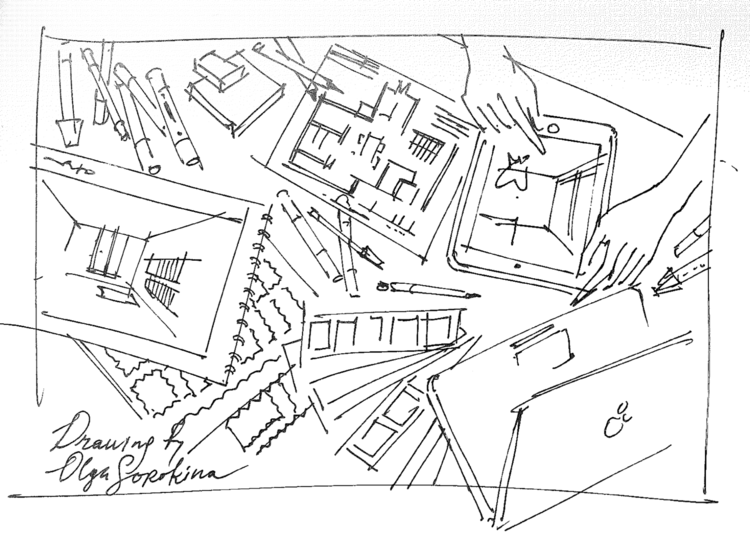

## Есть ли разница между наброском и скетчем?

На первый взгляд может показаться, что оба понятия означают одно и то же, и разницы нет никакой. Но есть тонкое различие, набросок является незаконченной работой, «подмалевок» к будущему шедевру, напротив, скетч — самостоятельная и полностью завершенная работа, которая передает определенное настроение или идею автора. Визуально, они могут быть очень схожи, без дополнительной детализации. Художник сам определяет, когда его творение можно считать законченным.

>На полях слишком пусто. соедини по две точки в одну линию в разнобой или "елочкой"

## Насколько подробным должен быть скетч?

Определенного и точного ответа на этот вопрос вы нигде не найдете, так как кроме автора скетча никто не сможет дать ответ. Суть в том, чтобы передать настроение, форму и контуры, тщательно прорабатывать детали при этом совсем не обязательно. Главное, понимать, что скетч не является академическим рисунком, тут эмоции и впечатления гораздо важнее портретного сходства. В скетчинге, стиль рисунка и манера могут быть совершенно любыми, и за такую гибкость и свободу все художники мира и творческие специалисты очень любят скетчинг.

[Источник](https://schoolofsketching.com/blog/tag/перспектива)

## Где используется скетчинг и чем он полезен

**Скетчинг** — инструмент, который помогает визуализировать идеи, развивать креативное мышление и улучшать коммуникацию. Его можно использовать в разных сферах — от дизайна и образования до бизнеса. 
При этом скетчинг может быть полезен не только в профессиональном плане, но и поможет развивать внимание, память и концентрацию.

Рассмотрим подробнее на конкретных примерах.

+ **Визуализация идей.** 
Выражая идеи визуально, вы переносите их из сферы абстрактных мыслей на бумагу или экран, что делает их более конкретными и понятными для других людей. Таким образом, вы имеете возможность исследовать различные варианты, экспериментировать с формами и композицией, и развивать собственные концепции.
+ **Дизайн.** 
Скетчинг - это техника, которую дизайнеры применяют для создания концепций продуктов, интерфейсов, архитектурных решений и других проектов. Они используют этот прием, чтобы быстро визуализировать свои идеи, экспериментировать с дизайном, вносить корректировки и представлять концепции клиентам или коллегам.
+ **Образование.** 
Скетчи помогают студентам визуализировать информацию и запоминать ее, развивают творческое мышление, способность к наблюдению и аналитические навыки. Они могут быть использованы в учебных материалах, презентациях, проектах и докладах, чтобы более наглядно и понятно представить информацию.
+ **Бизнес.** 
С помощью зарисовки возможно визуализировать бизнес-идеи, разрабатывать концепции продуктов или услуг, создавать дизайн маркетинговых материалов и улучшать коммуникацию внутри команды или с клиентами. Скетчи также помогают создавать макеты веб-сайтов, логотипов, рекламных кампаний и прототипов продуктов.
+ **Польза для когнитивных функций мозга.** 
Российские и зарубежные научные исследования подтверждают, что скетчинг имеет положительное влияние на когнитивные функции мозга. Он способствует развитию внимательности, памяти, концентрации и креативного мышления. Также он стимулирует активность мозга, улучшает визуальное восприятие и развивает моторику рук. Эти навыки и преимущества особенно полезны для детей, студентов и профессионалов, работающих в творческих сферах.

[Источник](https://blog.skillbox.by/dizajn/iskusstvo-v-prostom-chto-takoe-sketching-i-zachem-on-nuzhen/)

## Домашнее задание: "Неотрывное наблюдение"

1. Ваша задача состоит в том, чтобы в течение дня записывать и описывать в дневник все предметы и объекты вокруг вас, которые обычно не привлекают ваше внимание. 
    >Пример:  Телефон
    >
    >Прямоугольная форма с закругленными краями. Гладкая текстура, с едва ощутимыми ребрами на задней крышке. Не имеет изгибов. Структура: Монолитный, состоит из пластика и стекла. Черный корпус с серебристой рамкой.

2. Наблюдайте объекты различной формы, рисунки, текстуры, цвета и архитектурные элементы.

3. Дневник должен содержать подробные описания примечательных аспектов каждого объекта, включая форму, текстуру, изгибы и структуру.

4. При указании цветов, используйте слова, чтобы передать оттенки, такие как "светло-голубой", "темно-коричневый" и т. д.

5. На следующий день возьмите свой дневник и перечитайте записи. Попробуйте представить эти объекты, используя только описания, без рисования.

6. Используйте свои заметки в будущем, чтобы научиться лучше наблюдать и передавать детали визуально, в том числе через рисование.

7. После выполнения задания отметь ниже для контроля выполнения.

Важно помнить, что цель этого задания - развить наблюдательность и внимание к деталям вокруг вас, а также улучшить описание предметов без использования рисования.

---
[Содержание](#содержание)

## 1.3 Типы и виды скетчинга

**Скетчинг** - это техника, которая может принимать различные формы и подходы в зависимости от целей и предпочтений художника или дизайнера. Вот несколько типов скетчинга:

### Концептуальный скетчинг

Этот тип используется для визуализации и иллюстрации идей и концепций. Он помогает разрабатывать новые продукты, дизайны, архитектурные решения и другие проекты. Концептуальные скетчи могут быть грубыми и неочищенными, но они передают общую концепцию и суть идеи.

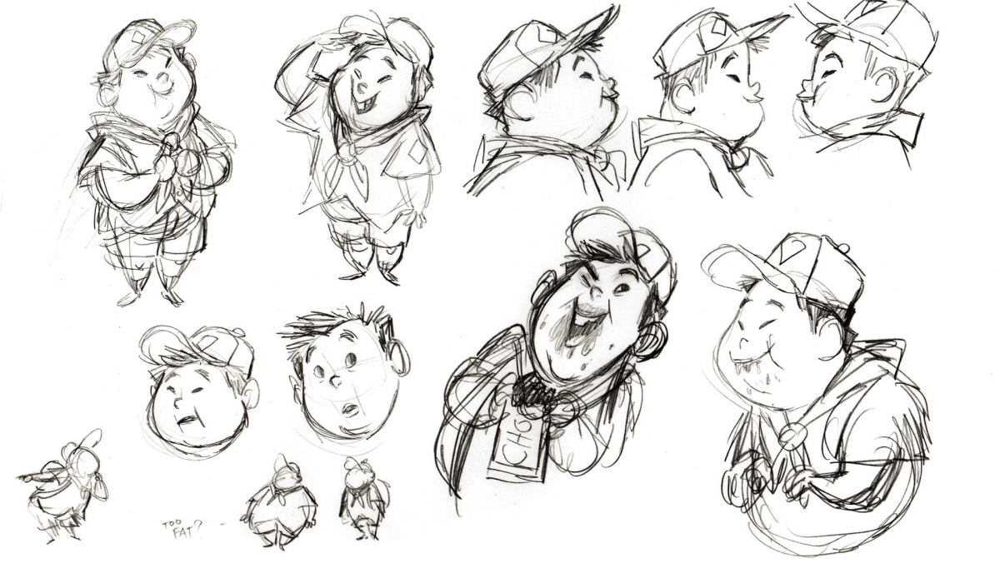
*Например, набросок персонажа из мультфильма "Вверх"*

[Источник](https://www.rabbleboy.com/the-art-of-up-book-preview/)

### Лифтовый скетч (простой)

Этот тип скетчинга предназначен для быстрого наброска и представления информации или идей с минимальными деталями. Лифтовые скетчи создаются за несколько секунд или минут и служат для быстрого обмена информацией.

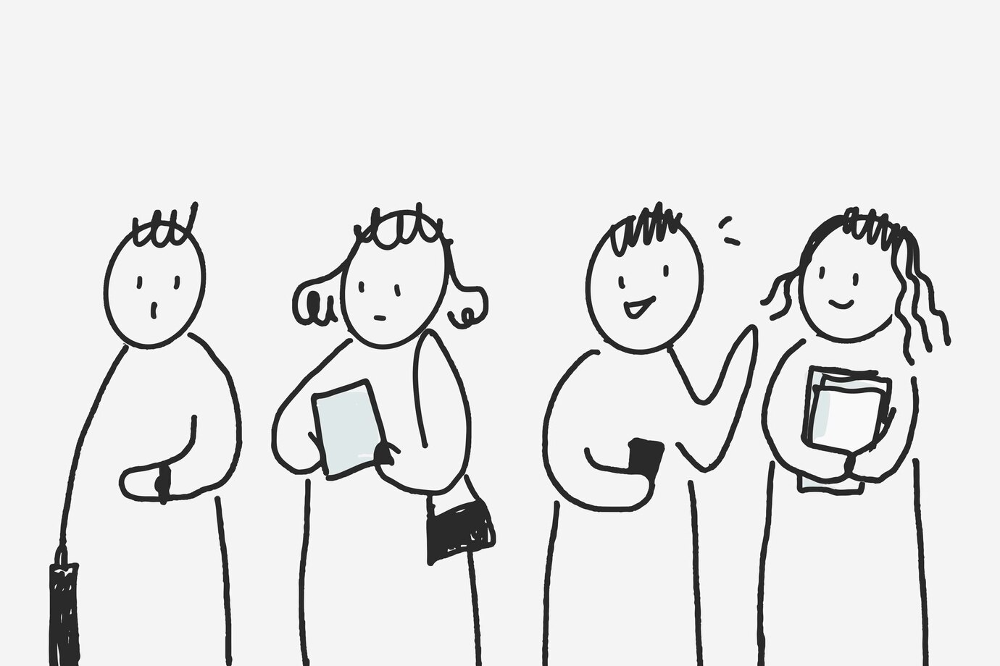
*Изображение от rawpixel.com на Freepik*
[Источник](https://ru.freepik.com/free-vector)

### Детализированный скетч

В отличие от простого лифтового скетча, детализированный скетч содержит больше деталей и информации. Он используется для более подробного описания и представления идей или дизайнов, включая тщательную отрисовку форм, текстур, теней и освещения.

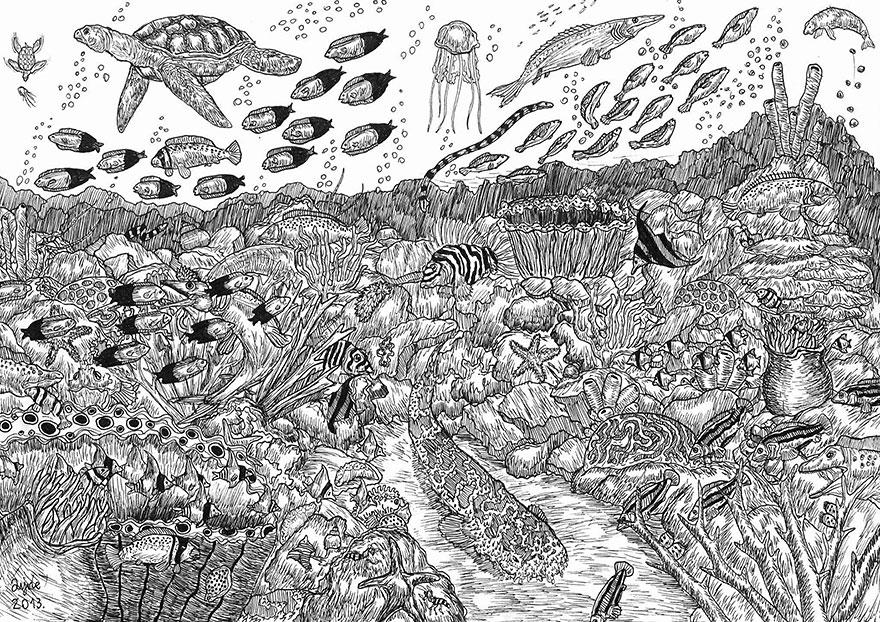

[Источник](https://fishki.net/1267297-11-letnij-vunderkind-sozdaet-potrjasajuwe-detalizirovannye-risunki.html)

### Акварельный или цветной скетчинг

Этот тип скетчинга добавляет цвет и насыщенность в работу. Акварельный скетчинг эффективен для создания атмосферы и настроения, а также для передачи различных материалов и текстур.

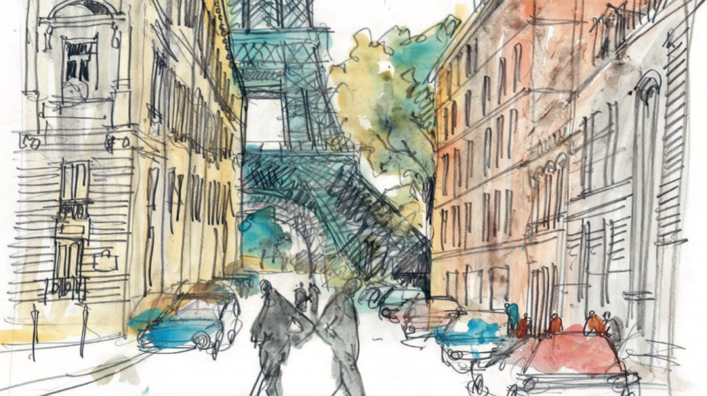
[Источник](https://www.amazon.in/Urban-Sketching-Step-Techniques-creating/dp/1782216839)

### Контурный скетчинг

В этом типе скетчинга используются только контуры и очертания объекта. Он помогает в схематичном представлении формы или структуры, а также в создании графических иллюстраций или комиксов.

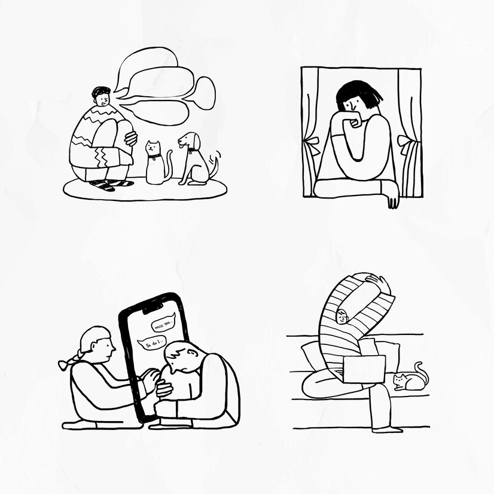
*Изображение от rawpixel.com на Freepik*
[Источник](https://ru.freepik.com/free-vector/social-issues-coronavirus-crisis-doodle-element-set-vector_30086939.htm#fromView=search&page=3&position=50&uuid=8aca02c1-d576-4bcc-a007-d4e27cfaf5f4)

Эти типы скетчинга можно комбинировать и адаптировать в соответствии с вашими потребностями и стилем работы. Важно помнить, что скетчинг - это инструмент для выражения идей и концепций, поэтому выбирайте тот вид и подход, который лучше всего соответствует вашим целям и визуальному стилю.

Несмотря на то, что скетчинг начинался как простая зарисовка, сегодня он становится отдельным и уникальным искусством, в рамках которого существует несколько направлений. Давайте рассмотрим некоторые из самых популярных видов скетчинга.

### Интерьерный скетчинг

Это изображение внутреннего пространства комнаты с ее мебелью, растениями. Для создания такого скетча необходимо понимание законов линейной перспективы и значение пропорций объектов в помещении. Чтобы работа получилась живой необходимо уметь передавать фактуры предметов.

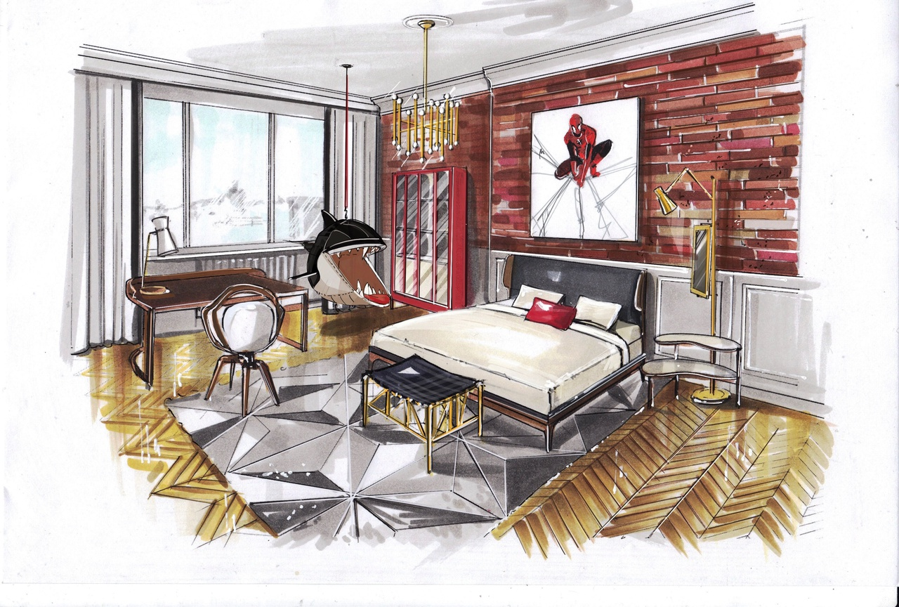
[Источник](https://www.instagram.com/p/BVXrXAzFSpT/)

### Промышленный скетчинг

Напоминает чертеж, но при этом рисуется значительно быстрее него. На [листе](https://artkvartal.ru/catalog/product/bumaga-dlya-markerov-the-wall-canson-list-70kh100-sm-plotnost-220-g-m2/) изображаются различные предметы нашей жизни и быта. Такой вид скетчинга часто используется дизайнерами и инженерами, так как помогает быстро зафиксировать идеи для будущих проектов.

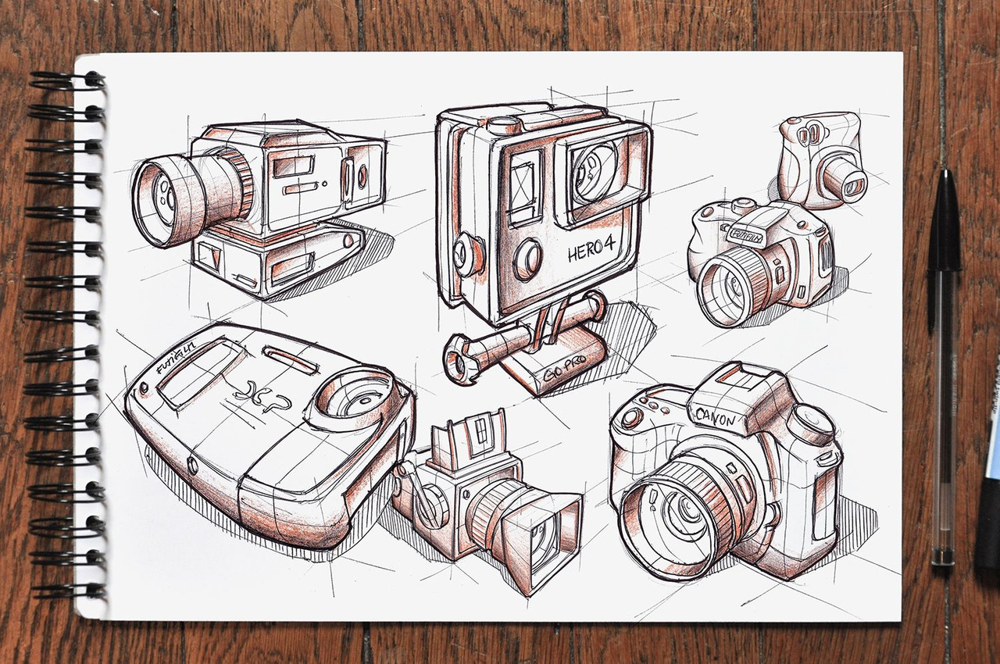
[Источник](https://ru.pinterest.com/pin/455919162254460053/)

### Fashion-скетчинг

Этот вид скетчинга прочно вошел в жизни дизайнеров одежды и фэшн-стилистов. Он помогает передать цвет и фактуру одежды, обуви, аксессуаров. Fashion-скетчинг позволяет проработать будущую прическу и макияж модели.

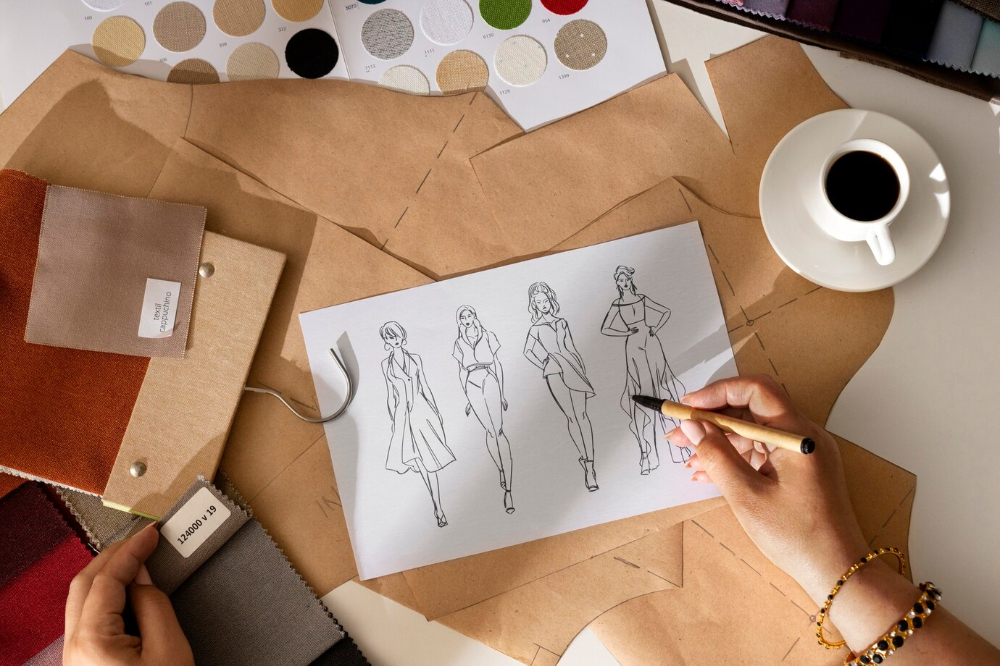
Источник: [Изображение от freepik](https://ru.freepik.com/free-photo/still-life-fashion-designer-s-office_150861778.htm#fromView=image_search_similar&page=1&position=9&uuid=2de7845f-8096-4d51-845e-cda3f29d1807)

### Travel-скетчинг

Помогает отобразить свое видение города или страны, которую вы посетили. Вдохновить на такие скетчи могут сделанные фотографии и привезенные сувениры.
>Как же хочется на море! Давай хоть волны на полях будут

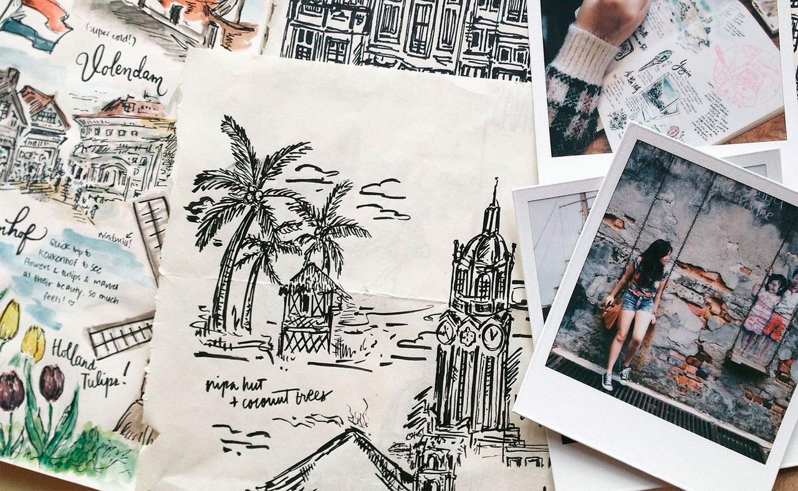
[Источник](https://artkvartal.ru/tutorials/vidy-sketchinga/)

### Food-скетчинг

Это направление зародилось благодаря моде на фотографии еды. Сюжеты могут быть крайне разнообразны. Некоторые блюда выглядят лучше на этапе готовки, а другие — уже в приготовленном виде.

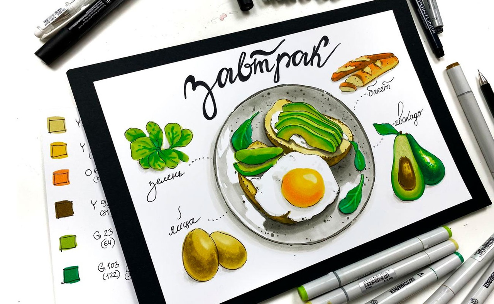
[Источник](https://dzen.ru/a/YkrBnKPejG6G0UpG)

### Ботанический скетчинг

Подразумевает зарисовки листочков, веточек, бутонов цветка — всего, что связано с растениями. В отличии от ботанической иллюстрации в скетче не так важны мельчайшие детали. Можно просто зарисовать строение растения с различных ракурсов.

[Источник](https://artkvartal.ru/tutorials/vidy-sketchinga/)

### Архитектурный (городской) скетчинг

Как и в интерьерном скетче здесь художнику понадобится знание перспективы и умение передавать масштабы объектов. Можно запечатлеть любимые места и виды города, архитектурные детали.

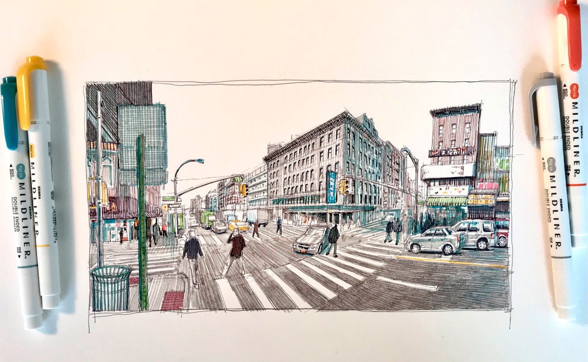
[Источник](https://artkvartal.ru/tutorials/vidy-sketchinga/)

### Ландшафтный скетчинг

Как понятно из названия, это способ визуализации ландшафтного дизайна. Такие иллюстрации очень часто используются профессиональными ландшафтными дизайнерами при работе с заказчиками.

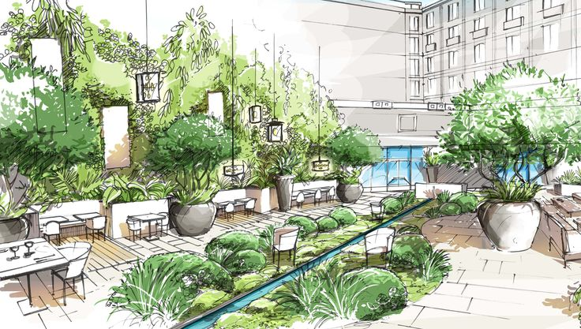
[Источник](https://sketchbook.store/landshaftnyj-sketching/)

### Портретный скетчинг

Портретный скетчинг — это стилизованные портреты, которые очень популярны среди иллюстраторов. Портреты в данном направлении могут быть анатомически неправильными, часто художники гиперболизирует некоторые части лица в портрете, в этом и заключается его основная изюминка.

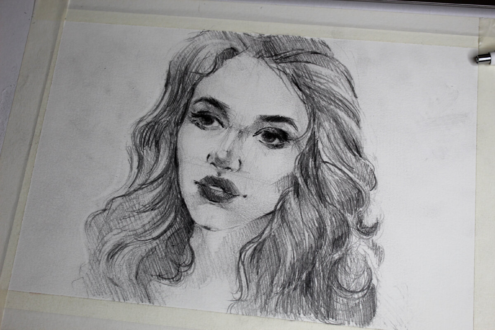
[Источник](https://dzen.ru/a/Ya3rSxXTyniAhYsM)

[Источник - Арт квартал](https://artkvartal.ru/tutorials/vidy-sketchinga/)

**Домашнее задание: "Мое впечатление визуального скетча":**

1. Ваша задача состоит в том, чтобы выбрать один из типов или видов скетчинга, которые были рассмотрены на уроке.

2. Примените выбранный тип или вид скетчинга для создания своего коллажа референсов. 
Рéференс — вспомогательное изображение: рисунок или фотография, которые художник или дизайнер изучает перед работой, чтобы точнее передать детали, получить дополнительную информацию, идеи. 
Советую для этого домашнего задания использовать сайт pinterest. На нем вы найти интересные идеи и сохранить их в группу под нужную затею, как бы "зацепить идею на доску".

3. Определитесь с темой или объектом вашего скетча (например, пейзаж, предмет, человек, здание и т. д.).

4. Соберите фотографии или изображения из разных источников, которые служат вам вдохновением или образцами для создания скетчей..

5. Попробуйте передать ваше впечатление о выбранной теме или объекте. Рассмотрите, что именно вы хотите выразить или передать. Также определите палитру цвета идеи.

6. После завершения коллажа, напишите краткое описание вашего впечатления и целей, которые вы хотели достичь.

7. Можно использовать полученные знания и навыки в будущем, чтобы совершенствовать свои навыки скетчинга и создавать более впечатляющие и выразительные работы.

8. После выполнения задания отметь ниже для контроля выполнения и проверьте работу через чек-лист.

Цель этого задания - использовать создание коллажа референсов для практики различных типов и видов скетчинга, а также развить способность передавать особенности и детали изображений через соответствующие элементы визуального языка.

Пример:

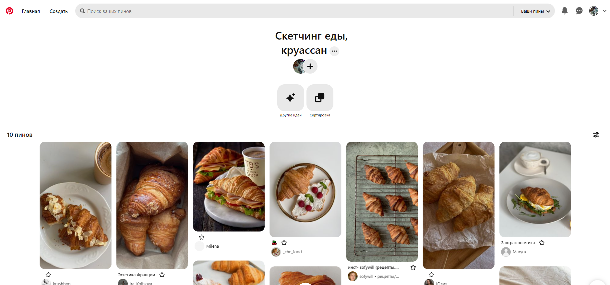

>Доска на Pinterest "Скетчинг еда, круассан", где собраны референсы подходящие под тему.

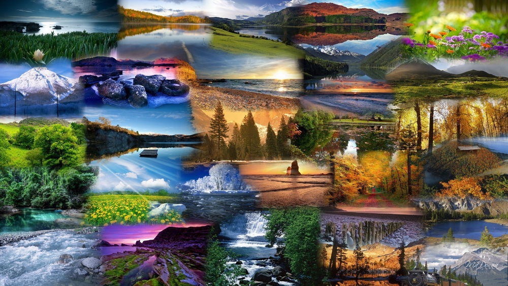

>Коллаж из изображений различных пейзажей

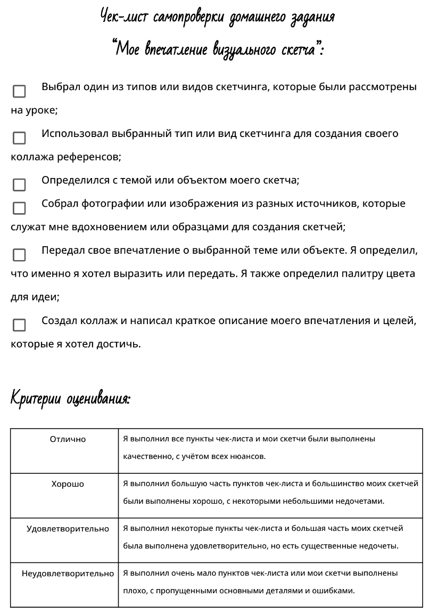

---
[Содержание](#содержание)

## 1.4 Инструменты и материалы

Самые основные принципы скетчинга — это передача первых впечатлений в быстром темпе и возможность выразить свои мысли и идеи. Основные художественные материалы, которые предпочитают использовать в данной технике: маркеры, тушь, карандаши, ручки и линеры, акварельные краски и другие инструменты: любой лист бумаги, блокнот или скетчбук.

И о каждом мы сейчас и поговорим!

[Минимальный набор инструментов для скетчинга](https://web-paint.site/uroki-risovaniya/sketching/minimalnyj-nabor-instrumentov-dlya-sketchinga.html)

[Акварель для начинающих](https://zvetnoe.ru/club/poleznye-stati/akvarel-dlya-nachinayushchikh/)

---
[Содержание](#содержание)

## 1.5 Итоговый тест по пройдённому материалу

---
[Содержание](#содержание)
